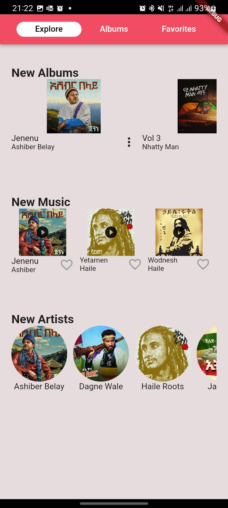
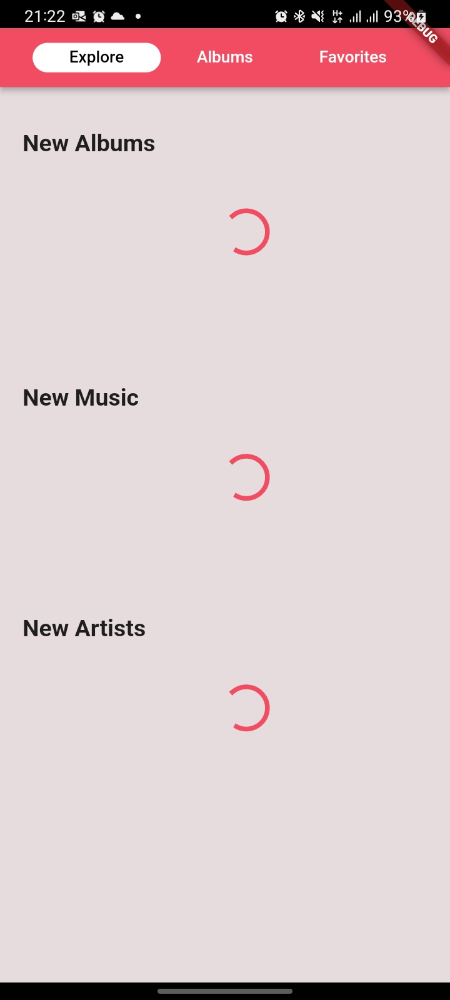
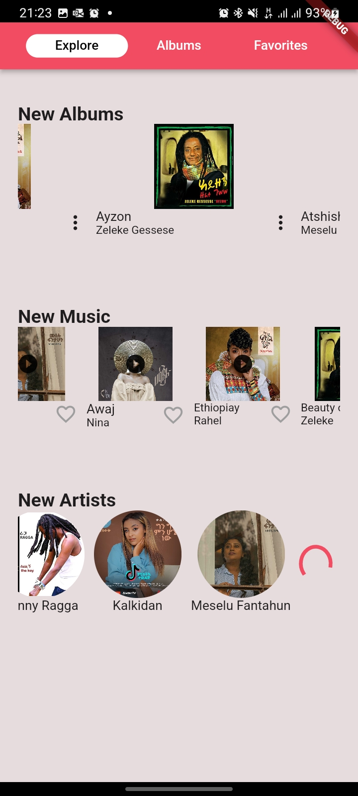
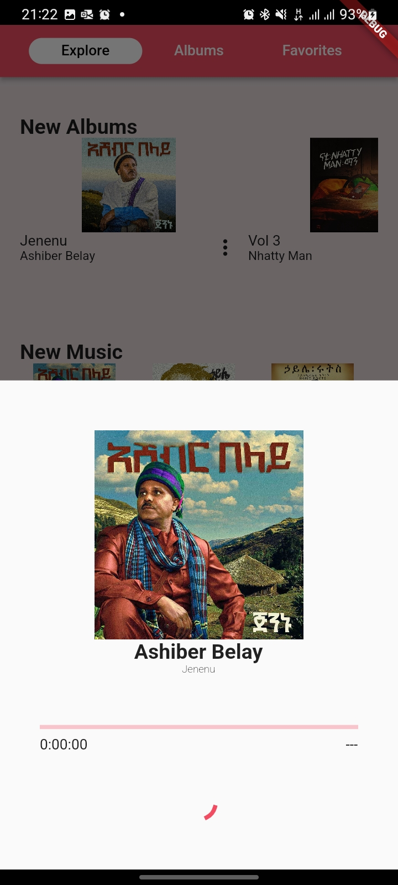
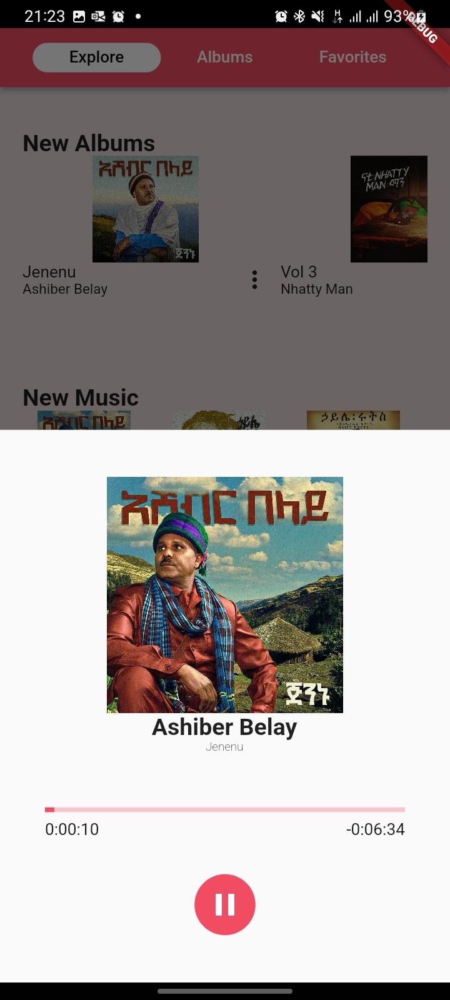

# Zema Multimedia Developer Position Project

## Required  Implementations

This project is an implementation of this [design](https://www.figma.com/file/XNLG9Xi4bmVXIMI2d4zsyy/Zema-Multimedia-flutter-test-design?node-id=1-303&t=58qQv4XY3PFm6t82-0).
The following requirements have been satisfied:
- It is implemented using [Flutter/dart](https://flutter.dev/)
- The state management used is [Provider](https://pub.dev/packages/provider)
- All data is fetched from the provided API [Routes](https://exam.calmgrass-743c6f7f.francecentral.azurecontainerapps.io/swagger)
- Tracks can be added to a favourite list and removed from the favourite list.

- A version controll system is used for submitting.
## Extra  Implementations
- Lazily loaded albums & favorites page 

|   |  |
| ------------- | ------------- |
|   |   |
- Allowing the tracks to be played.
|   |  |
| ------------- | ------------- |
|   |   |

